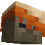

# More Mobs

> A data pack for 1.14x-1.19x

## Features

Mobs have new variants through custom heads or through hidden vanilla mobs!
No Resource pack needed!

**Supported Entities:**
Zombies, Husks, Drowned, Skeletons, Strays, Wither Skeletons, Mooshrooms, Illusioners

To exclude an entity, give it the tag `exclude`

## Installation

Download the latest release from [here](https://github.com/Tschipcraft/more_mobs/releases/latest) and put the datapack .zip file into the `datapacks` folder of your Minecraft world.

## Updates

To check for updates use `/trigger menu` and hit the Check for Updates button. There is also a **Reset** and an **Uninstall** button.

## Compatibility

Data packs are usually pretty compatible with newer versions of the game. This data pack however also features a version checker which notifies you, if you are playing with an (to the data pack) unknown version. If the data pack works fine and I'm just too lazy to update it in time, you can turn it off with the command `/scoreboard players set tvc_ignore global 1`
